* [I. Manage inventory](./main.md#i-manage-inventory)
    * [Manage Products](./main.md#manage-products)
    * [Manage unites, brands and categories](./main.md#manage-unites-brands-and-categories)
    * [Manage recipes](./main.md#manage-recipes)
    * [Manage barcodes](./main.md#manage-barcodes)
* [II. Manage sales](./main.md#ii-manage-sales)
    * [Manage customers](./main.md#manage-customers)
    * [Manage sales](./main.md#manage-sales)
* [III. Manage purchases](./main.md#iii-manage-purchases)
    * [Manage suppliers](./main.md#manage-suppliers)
    * [Manage purchases](./main.md#manage-purchases)

## I. Manage inventory

### Manage products

Users have the ability to fill out their inventory with products, each product has the following information

  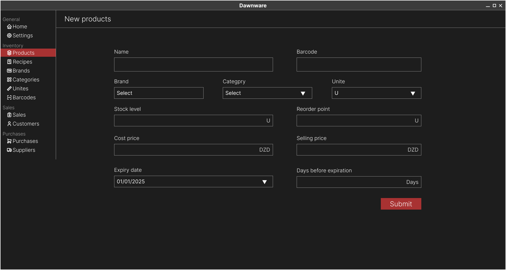

Users have the ability to see the list of all products, filter and search by different factors, in the list they can see the stock levels of each product and other information

  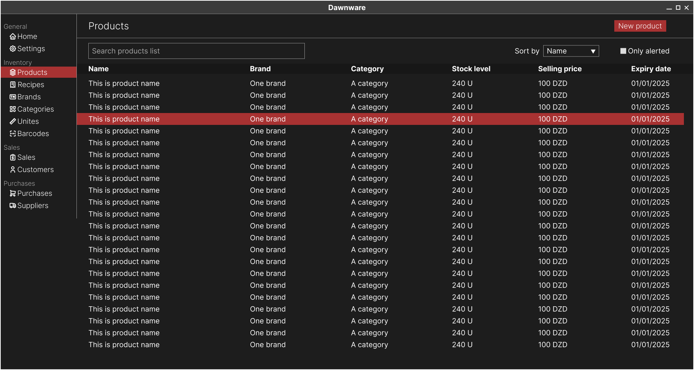

Users also have the ability to delete or edit the infomation of a certain product, except the stock level to keep a history of the restock processes.

### Manage unites, brands and categories

Users have the ability to create, view, edit and delete any unite, brand or category, each one of these entities has the following information:

  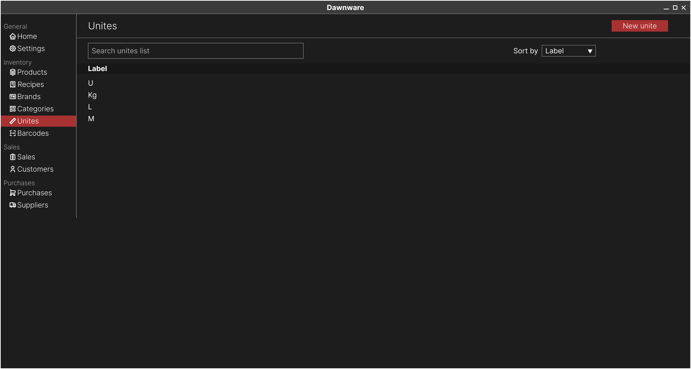

  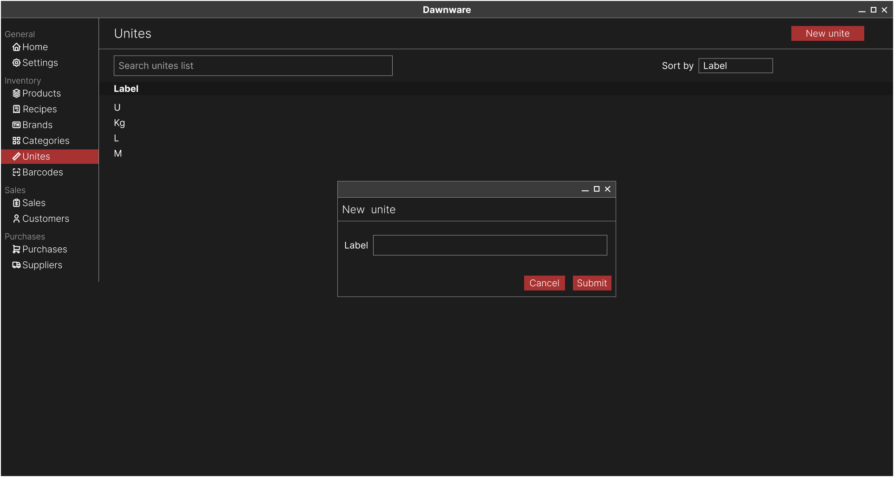

### Manage recipes

Users have the ability to create recipes, a recipe is a collection of products with predefined quantity.

  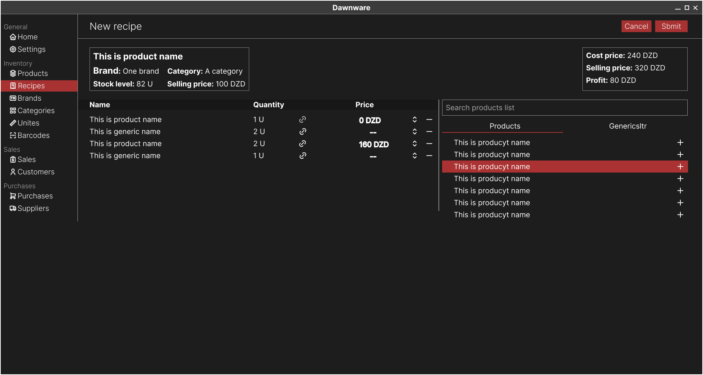

Sometimes users can't predefine all the ingredients of a recipe, the only thing a user knows is the quantity of an ingredient in the recipe, a generic component is an ingredient that can be linked to any product in the futer.

  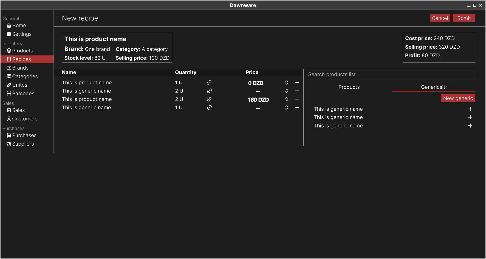

  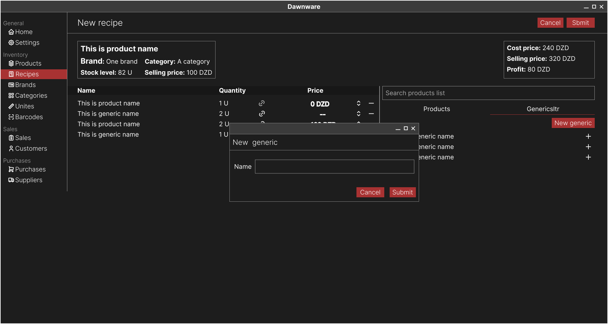

Users have the ability to clone existing recipes and make modifications to facilitate the process of recipe creation.

Users can view the list of recipes with some stats, edit and delte any recipe

  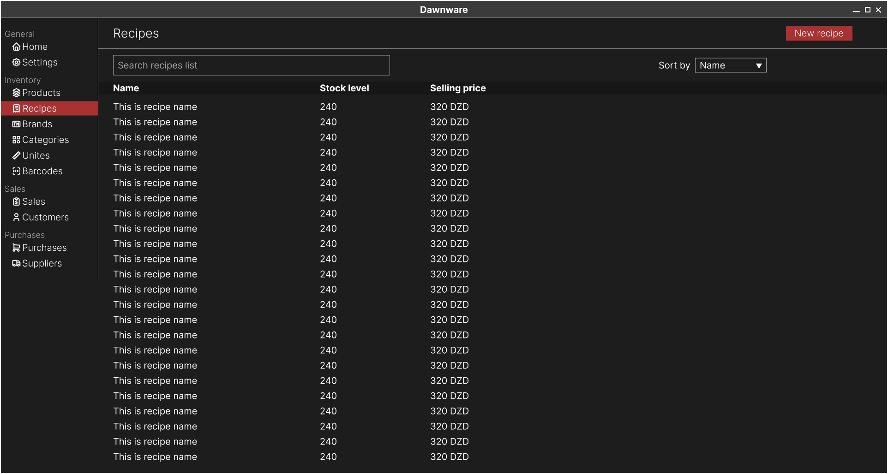

**Recipe selling price:**
* Ingredients custom price: Users can specify a custom price for a certain quantity of a product.
* Ingredients total cost: It's the sum of the selling prices of all ingredients.
* Markup price: Users can specify a markup price for the recipe which can be a percentage or a fixed amount.
* The selling price of a recipe is the sum of the total cost and the markup price.

### Manage barcodes

Users can create and print barcodes for all products with no barcode, a certain product or a group of products or recipes

## II. Manage sales

### Manage customers

Users have the ability to create customers, each customer has the following information:

  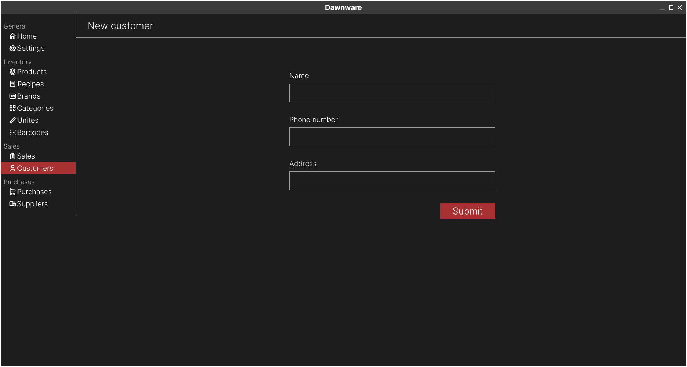

Users then can see the list of all customers and some stats, such as the total price of this customer, the product this customer buy the most, the number of sales and other.

  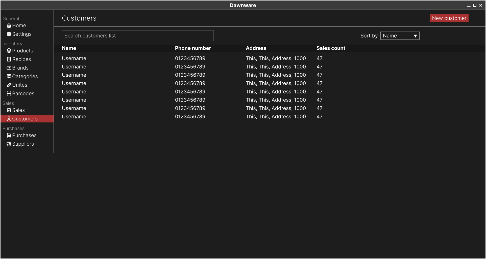

Users can edit or delete any customer. The cusomter is marked as deleted but still exists in the datebase

### Manage sales
Users have the ability to create a sale.

  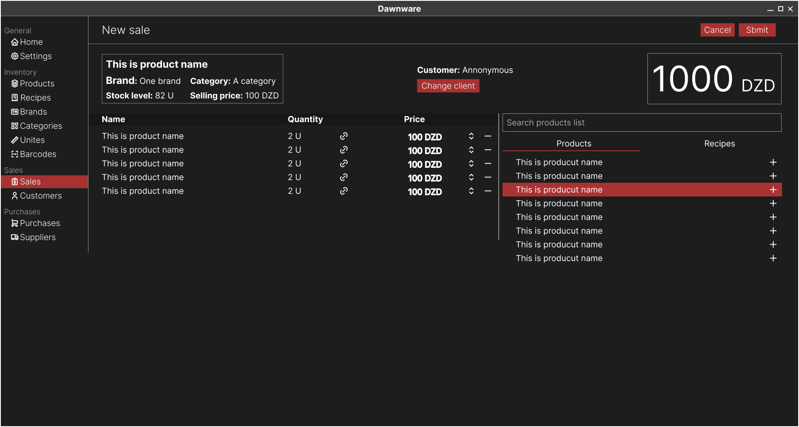

  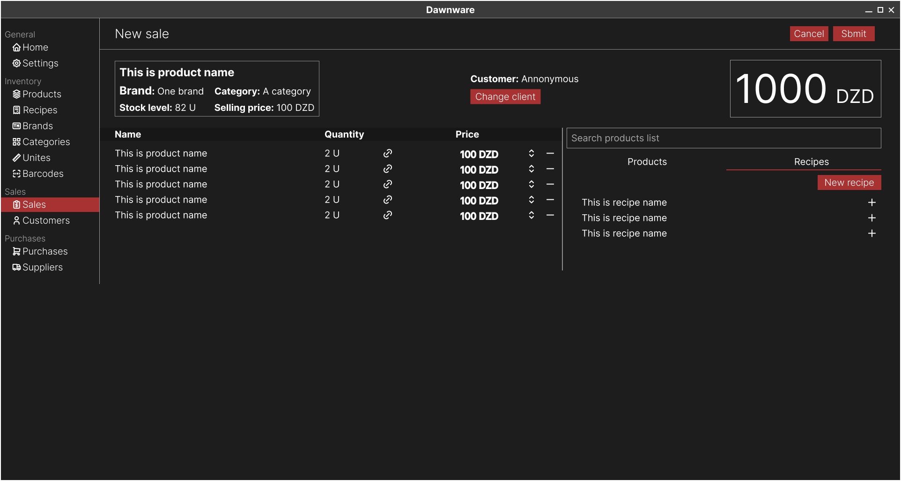

When a recipe is chosen, the user will be redirected to a an other page to customize the recipe blueprint for this sale, where they can link actual products to the recipe's generic components, add, remove, or change the quantity of produts, the unlinked generic components will be ignored in the sale.

  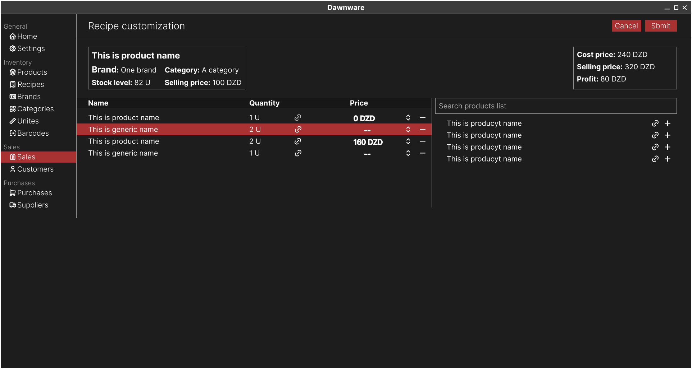

Users have the ability view the list of sales with some stats, edit and delete any sale. When a sale is deleted the products get back to inventory.

  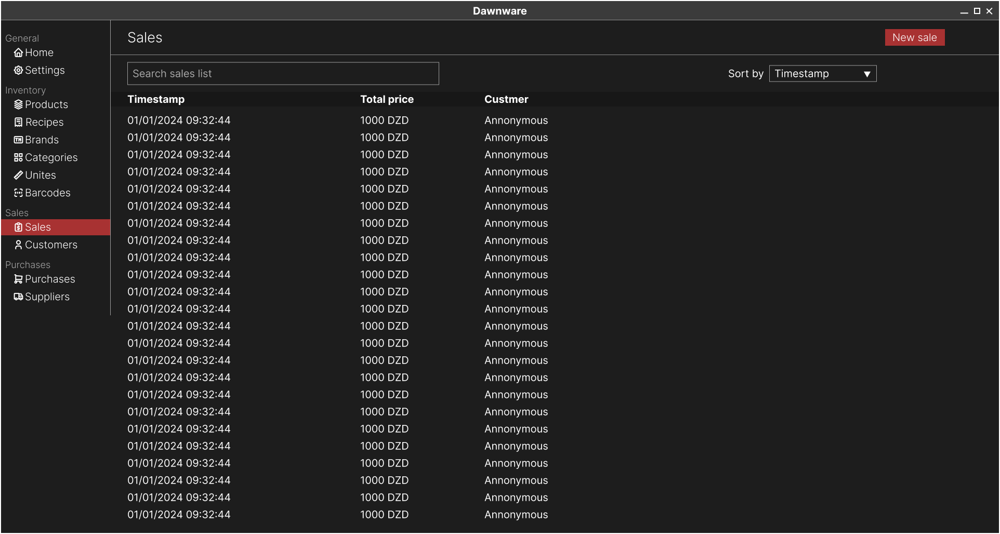

## III. Manage purchases

### Manage suppliers

Users have the ability to create suppliers, each supplier has the following information:

  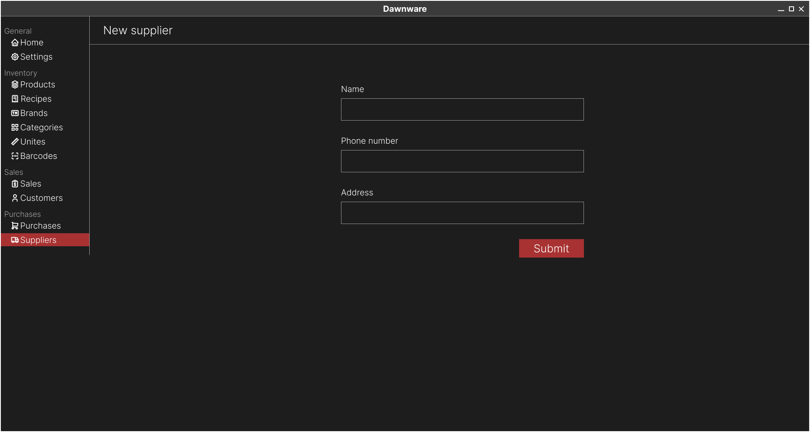

Users then can see the list of all suppliers and some stats, such as the total price of this supplier, the product this supplier sell the most, the number of purchases and other.

  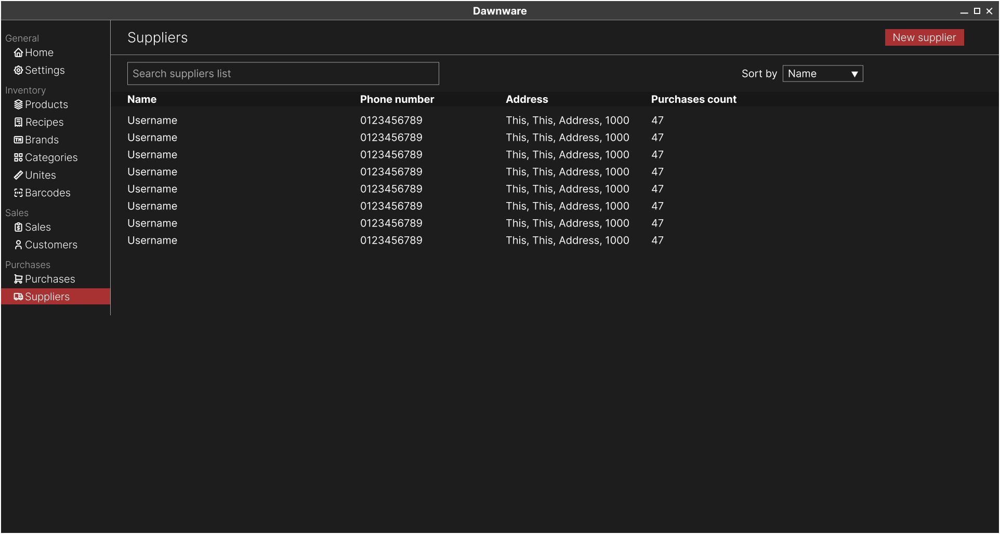

Users can edit or delete any supplier.

### Manage purchases

Users can create a new purchase to buy new product or a list of products from one or more suppliers, the bought quantity is added automatically to the inventory.

  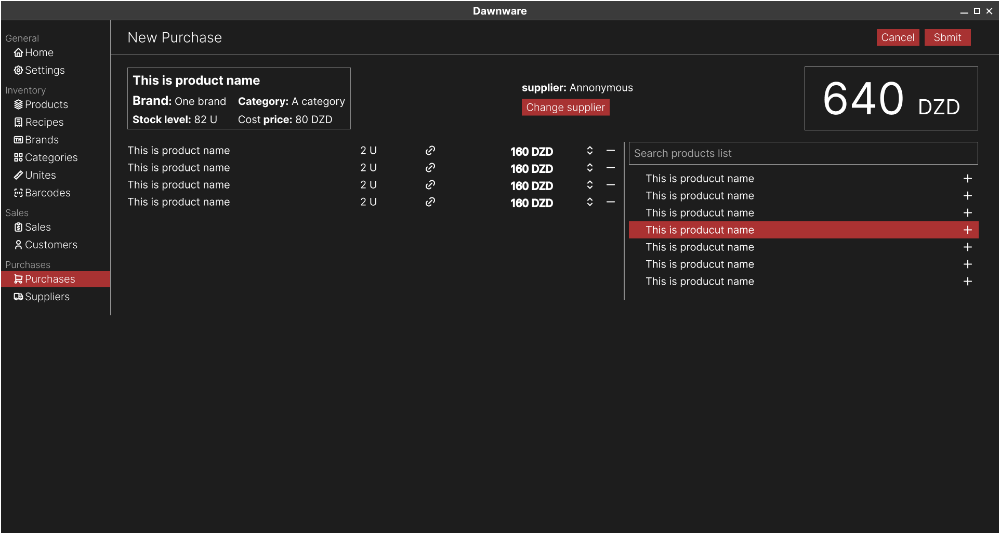

Users have the ability view the list of purchases with some stats, edit and delete any purchase.

  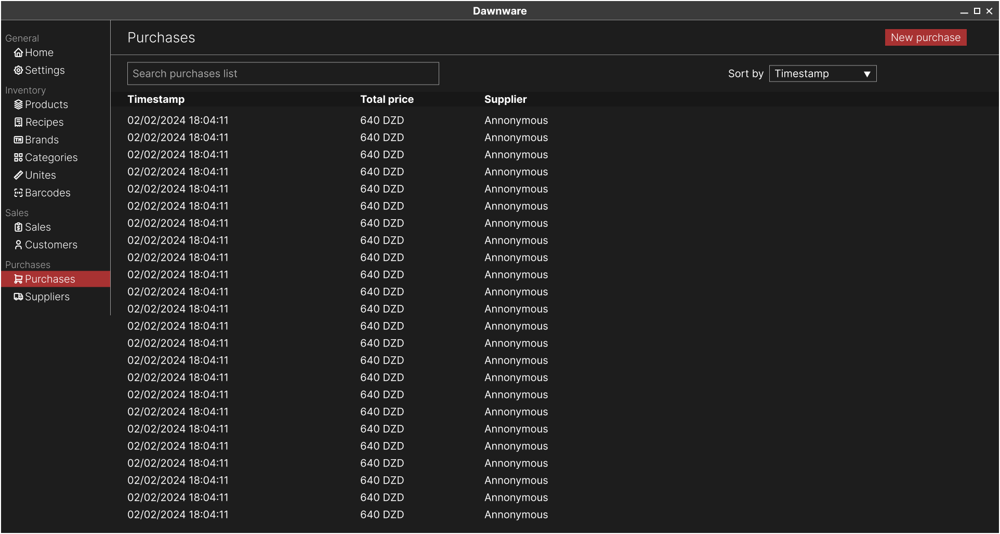

