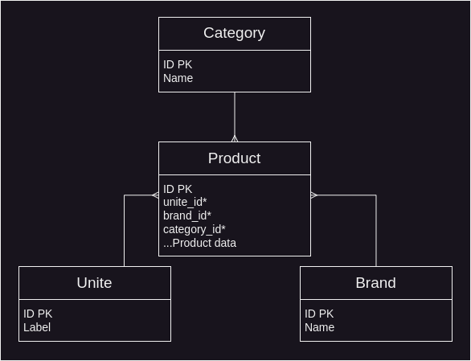
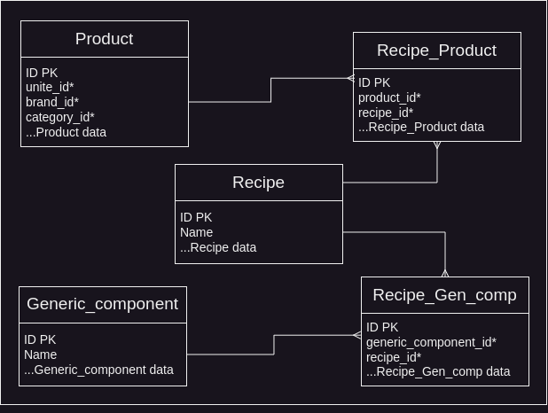
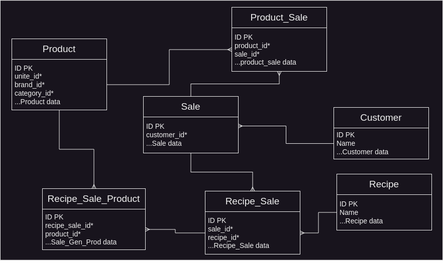
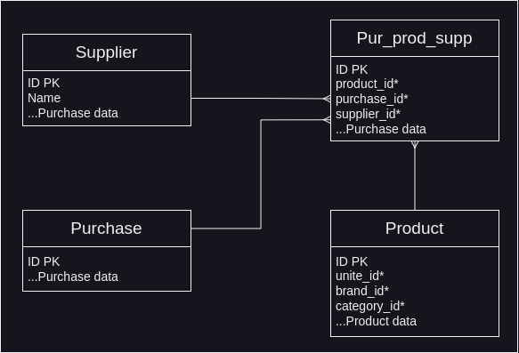

# MVP

* [I. Manage inventory](./mvp.md#i-manage-inventory)
    * [Manage Products](./mvp.md#manage-products)
    * [Manage unites, brands and categories](./mvp.md#manage-unites-brands-and-categories)
    * [Manage recipes](./mvp.md#manage-recipes)
    * [Manage barcodes](./mvp.md#manage-barcodes)
* [II. Manage sales](./mvp.md#ii-manage-sales)
    * [Manage customers](./mvp.md#manage-customers)
    * [Manage sales](./mvp.md#manage-sales)
* [III. Manage purchases](./mvp.md#iii-manage-purchases)
    * [Manage suppliers](./mvp.md#manage-suppliers)
    * [Manage purchases](./mvp.md#manage-purchases)
* [General notes](./mvp.md#general-notes)

## I. Manage inventory

<div style="text-align:center">
  
</div>

### Manage products

Users have the ability to fill out their inventory with products, each product has the following information

```
Product (ID, name, barcode, brand_id*, category_id*, unit_id*, stock_level, reorder_point, cost_price, retail_selling_price, unite_profit, total_profit, VAT, expiry_date, days_before_expiration, creation_date)
```

**Notes**
* The ability to scan the barcode to auto fill the input field
* The cost price and selling price should be per a defined number of unites for example `3500ZD/1000ml` (an optional feature)

Users have the ability to see the list of all products, filter and search by different factors, in the list they can see the stock levels of each product, with a sign on the products that about to run out of stock and those that about to expire.

Users have the ability to delete any product, the product is marked as deleted but still exists in the database because many other things depend on it. 

Users also have the ability to edit the infomation of a certain product, except the stock level to keep a history of the restock processes.

**Problems**
* Have the ability to edit the stock level?

### Manage unites, brands and categories

Users have the ability to create, view, edit and delete any unite, brand or category, each one of these entities has the following information:

```
Unite (ID, label, creation_date)
```
```
Brand (ID, name, creation_date)
```
```
Category (ID, name, creation_date)
```

### Manage recipes

<div style="text-align:center">
  
</div>

Users have the ability to create recipes, a recipe is a collection of products with predefined quantity for each product, each recipe and recipe product have the following information:

```
Recipe (ID, name, max_quantity, unite_cost_price, selling_price, unite_profit, total_profit, creation_date)
```
```
Recipe_Products (ID, recipe_id*, product_id*, product_quantity)
```

Sometimes users can't predefine all the ingredients of a recipe, the only thing a user knows is the quantity of an ingredient in the recipe, a generic component is an ingredient that can be linked to any product in the futer, each generic component has the following infomation:

```
Generic_component (ID, name, creation_date)
```
```
Recipe_Gen_comp (ID, recipe_id*, recipe_generic_component_id*, quantity)
```

Users have the ability to clone existing recipes and make modifications to facilitate the process of recipe creation.

Users can view the list of recipes with some stats, edit and delte any recipe

**Recipe selling price:**
* Ingredients custom price: Users can specify a custom price for a certain quantity of a product.
* Ingredients total cost: It's the sum of the selling prices of all ingredients.
* Markup price: Users can specify a markup price for the recipe which can be a percentage or a fixed amount.
* The selling price of a recipe is the sum of the total cost and the markup price.

**Problems:**
* A product may have different custom selling prices in different recipes, if the cost price of a product chagned users should change the custom price manually ih all recipe blueprints.

### Manage barcodes

Users can create and print barcodes for all products with no barcode, a certain product or a group of products or recipes

## II. Manage sales

<div style="text-align:center">
  
</div>

### Manage customers

Users have the ability to create customers, each customer has the following information:

```
Customer (ID, name, address, phone_number, creation date)
```

Users then can see the list of all customers and some stats, such as the total price of this customer, the product this customer buy the most, the number of sales and other.

Users can edit or delete any customer. The cusomter is marked as deleted but still exists in the datebase

### Manage sales
Users have the ability to create a sale each with the following information

```
Sale (ID, customer_id*, total_tax, total_price, profit, creation_date)
```
```
Product_Sale (ID, sale_id*, product_id*, product_quantity)
```
```
Recipe_Sale (ID, sale_id*, recipe_id*, name, creation_date)
```
```
Recipe_Sale_Product (ID, recipe_sale_id*, product_id*, product_quantity)
```

**Notes**
* Users can specify the quantity of each product in the list of products and the price will be calculated automatically and vise versa
* If the product is choosen more that one time, the quantity increases
* Cost selling prices of a product should be stored in a sale, or problems will acure, because users have the ability to change these prices at any time, and the sale is made.

Users have the ability view the list of sales with some stats, edit and delete any sale. When a sale is deleted the products get back to inventory.

## III. Manage purchases

<div style="text-align:center">
  
</div>

### Manage suppliers

Users have the ability to create suppliers, each supplier has the following information:

```
Supplier (ID, name, address, phone_number, creation date)
```

Users then can see the list of all suppliers and some stats, such as the total price of this supplier, the product this supplier sell the most, the number of purchases and other.

Users can edit or delete any supplier. The supplier is marked as deleted but still exists in the datebase

### Manage purchases

Users can create a new purchase to make buy new product or a list of products from one or more suppliers, the bought quantity is added automatically to the inventory, each purchase has the following information:

```
Purchase (ID, total_price, creation_date)
```
```
Pur_Prod_Supp (ID, purchase_id*, supplier_id*, product_id*, product_quantity, product_cost_price)
```

Users have the ability view the list of purchases with some stats, edit and delete any purchase.

**Problems**
* When deleting a purchase or edit a purchase and remove some products, does the quantity in the inventory decreases
* When purchase a product, what happens if we want to change the cost and selling prices of the product

### General notes
* IDs are auto-generated
* Some input fields are required and some are not
* What happens when deleting/editting some entities such as a customer or a product and there are some other entities that depend on.
